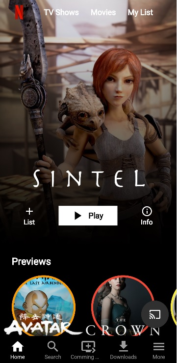
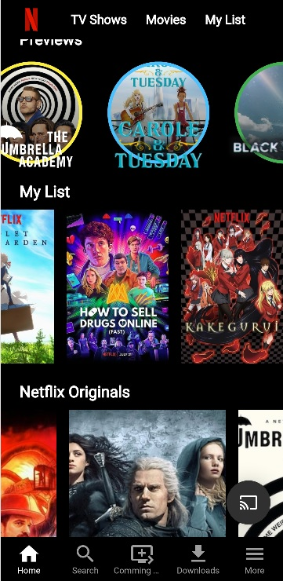
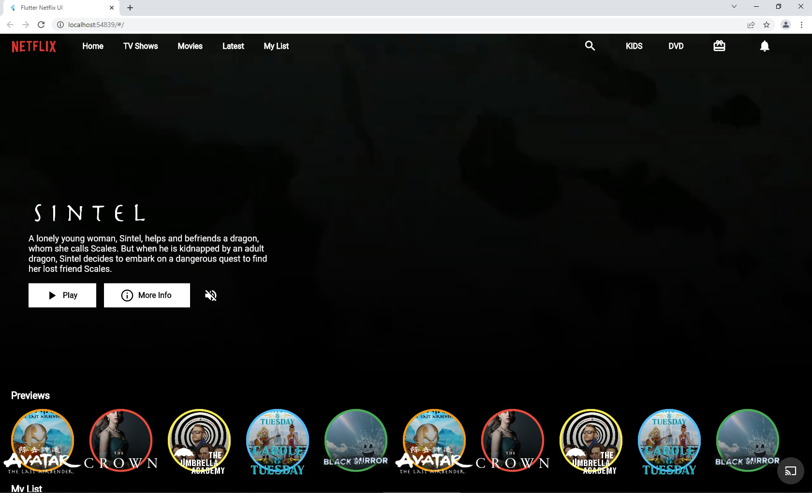
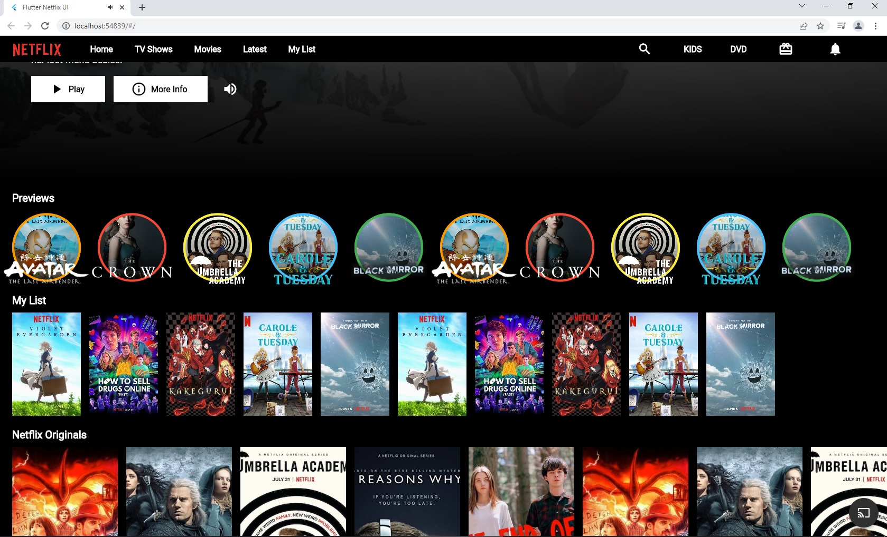

# Netflix Clone Ui

Projeto onde foi criado um clone da interface da Netflix para mobile e web.

## 📷 Screenshots

| Mobile - Home Page | Mobile - Home Page |
|------|-------|
|||
| Web - Home Page | Web - Home Page |
|||

## 🚀 Começando

Clone ou baixe o projeto.


### 📋 Pré-requisitos

* Pacotes especificados no arquivo pubspec.yaml


### 🔧 Instalação

* Para instalar os pacotes, estando com o terminal aberto na pasta do projeto execute o comando:
```
flutter pub get
```


## ⚙️ Executando os testes

Após obtidos os pacotes execute:

```
flutter run
```
E escolha onde irá rodar seu app.


## 🛠️ Construído com

* [Flutter](https://flutter.dev/) - Framework utilizado.


## 🎁 Expressões de gratidão

* Um projeto de estudo de desenvolvimento em flutter.


---
⌨️ com ❤️ por [Danilo Lima](https://github.com/danilolimadev/danilolimadev) 😊